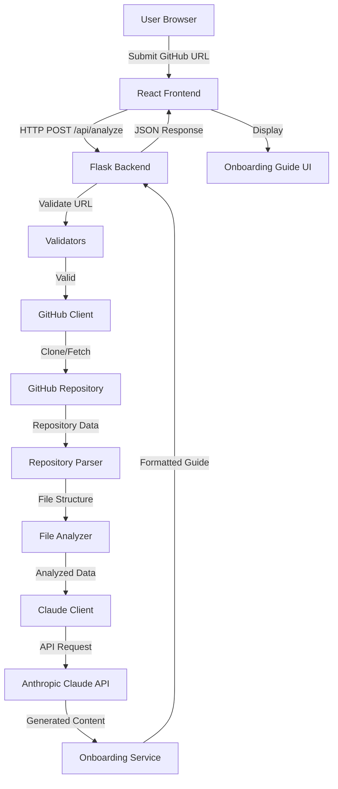

# AI-Powered Developer Onboarding Platform - Architecture Plan

## Project Overview
A full-stack application that analyzes GitHub repositories and generates AI-powered onboarding guides for new developers.

## Technology Stack

### Backend
- **Framework**: Flask (Python 3.9+)
- **AI Provider**: Anthropic Claude API
- **GitHub Integration**: PyGithub / GitPython
- **HTTP Client**: requests
- **Environment Management**: python-dotenv
- **CORS**: flask-cors

### Frontend
- **Framework**: React 18+ with Vite
- **HTTP Client**: axios
- **Markdown Rendering**: react-markdown
- **Styling**: Tailwind CSS
- **State Management**: React Hooks (useState, useEffect)
- **Routing**: React Router (optional for multi-page)

## Project Structure

```
legacy-onboard/
├── backend/
│   ├── app.py                      # Flask application entry point
│   ├── config.py                   # Configuration management
│   ├── requirements.txt            # Python dependencies
│   ├── .env.example               # Environment variables template
│   ├── routes/
│   │   ├── __init__.py
│   │   └── repository_routes.py   # API endpoints
│   ├── services/
│   │   ├── __init__.py
│   │   ├── repository_service.py  # Repository analysis logic
│   │   └── onboarding_service.py  # Onboarding generation orchestration
│   ├── github/
│   │   ├── __init__.py
│   │   ├── github_client.py       # GitHub API integration
│   │   └── repository_parser.py   # Parse repo structure
│   ├── ai/
│   │   ├── __init__.py
│   │   ├── claude_client.py       # Anthropic Claude integration
│   │   └── prompt_templates.py    # AI prompt engineering
│   └── utils/
│       ├── __init__.py
│       ├── validators.py          # Input validation
│       ├── file_analyzer.py       # File type detection
│       └── error_handlers.py      # Custom error handling
├── frontend/
│   ├── package.json
│   ├── vite.config.js
│   ├── index.html
│   ├── .env.example
│   ├── src/
│   │   ├── main.jsx               # React entry point
│   │   ├── App.jsx                # Main app component
│   │   ├── pages/
│   │   │   ├── HomePage.jsx       # Landing page with URL input
│   │   │   └── OnboardingPage.jsx # Display generated guide
│   │   ├── components/
│   │   │   ├── RepositoryForm.jsx # URL submission form
│   │   │   ├── LoadingSpinner.jsx # Loading indicator
│   │   │   ├── ErrorMessage.jsx   # Error display
│   │   │   ├── OnboardingGuide.jsx # Main guide display
│   │   │   ├── MarkdownRenderer.jsx # Markdown content
│   │   │   └── TechStackBadges.jsx # Tech stack visualization
│   │   ├── hooks/
│   │   │   ├── useRepository.js   # Repository analysis hook
│   │   │   └── useApi.js          # API communication hook
│   │   ├── services/
│   │   │   └── api.js             # Axios API client
│   │   └── styles/
│   │       └── index.css          # Global styles
│   └── public/
│       └── favicon.ico
├── .gitignore
└── README.md
```

## System Architecture



## API Endpoints

### POST `/api/analyze`
Analyze a GitHub repository and generate onboarding guide.

**Request Body:**
```json
{
  "repository_url": "https://github.com/username/repo"
}
```

**Response:**
```json
{
  "success": true,
  "data": {
    "repository": {
      "name": "repo-name",
      "owner": "username",
      "url": "https://github.com/username/repo"
    },
    "onboarding": {
      "overview": "Project description...",
      "tech_stack": ["Python", "React", "PostgreSQL"],
      "folder_structure": "Explanation of folders...",
      "setup_instructions": "Step-by-step setup...",
      "entry_points": ["src/main.py", "src/app.js"],
      "contribution_guide": "How to contribute...",
      "learning_path": "Suggested learning order..."
    }
  }
}
```

**Error Response:**
```json
{
  "success": false,
  "error": {
    "message": "Invalid repository URL",
    "code": "INVALID_URL"
  }
}
```

### GET `/api/health`
Health check endpoint.

**Response:**
```json
{
  "status": "healthy",
  "timestamp": "2026-05-15T23:00:00Z"
}
```

## AI Workflow Pipeline

### 1. Repository Analysis Phase
- Clone or fetch repository contents
- Parse directory structure
- Identify file types and languages
- Extract key files (README, package.json, requirements.txt, etc.)
- Detect frameworks and dependencies

### 2. Content Extraction Phase
- Read important configuration files
- Extract code samples from entry points
- Identify documentation files
- Analyze folder naming conventions

### 3. AI Generation Phase
- **Prompt 1**: Project Overview & Tech Stack
  - Input: Repository metadata, file list, dependencies
  - Output: High-level description, detected technologies

- **Prompt 2**: Architecture Explanation
  - Input: Folder structure, file organization
  - Output: Architecture overview, design patterns

- **Prompt 3**: Setup Instructions
  - Input: Config files, dependencies, README
  - Output: Step-by-step setup guide

- **Prompt 4**: Developer Onboarding
  - Input: Entry points, code structure, contribution docs
  - Output: Onboarding steps, learning path, contribution workflow

### 4. Response Formatting Phase
- Combine all AI outputs
- Format as structured JSON
- Add metadata and timestamps
- Return to frontend

## GitHub Integration Strategy

### Option 1: Shallow Clone (Recommended for MVP)
```python
import git
import tempfile

def clone_repository(repo_url):
    temp_dir = tempfile.mkdtemp()
    git.Repo.clone_from(repo_url, temp_dir, depth=1)
    return temp_dir
```

**Pros:**
- Fast for large repositories
- Complete file access
- Works offline after clone

**Cons:**
- Requires disk space
- Cleanup needed

### Option 2: GitHub API (Alternative)
```python
from github import Github

def fetch_repository(repo_url):
    g = Github(access_token)
    repo = g.get_repo("username/repo")
    return repo
```

**Pros:**
- No disk space needed
- Direct API access
- Rate limit aware

**Cons:**
- API rate limits (60/hour unauthenticated, 5000/hour authenticated)
- Slower for large repos
- Requires internet connection

### Recommended Approach
Use **shallow clone** for MVP, with fallback to GitHub API if clone fails.

## Handling Large Repositories

### 1. File Filtering
```python
IGNORED_PATTERNS = [
    'node_modules/', 'venv/', '.git/', 'dist/', 'build/',
    '*.log', '*.pyc', '*.min.js', '*.map'
]
```

### 2. Size Limits
- Max repository size: 500MB
- Max file size for analysis: 1MB
- Max files to analyze: 1000

### 3. Sampling Strategy
- Prioritize root-level files
- Sample from each major directory
- Focus on configuration and entry point files

### 4. Timeout Protection
- Set 60-second timeout for cloning
- 30-second timeout per AI request
- Overall 5-minute timeout for analysis

## Security Considerations

### 1. Input Validation
- Validate GitHub URL format
- Check for malicious URLs
- Sanitize repository names
- Prevent path traversal

### 2. Rate Limiting
```python
from flask_limiter import Limiter

limiter = Limiter(
    app,
    default_limits=["10 per minute", "100 per hour"]
)
```

### 3. Temporary File Cleanup
```python
import atexit
import shutil

def cleanup_temp_files():
    shutil.rmtree(temp_dir, ignore_errors=True)

atexit.register(cleanup_temp_files)
```

### 4. API Key Protection
- Store in environment variables
- Never commit to version control
- Use `.env` files locally
- Use secrets management in production

### 5. CORS Configuration
```python
from flask_cors import CORS

CORS(app, resources={
    r"/api/*": {
        "origins": ["http://localhost:5173"],
        "methods": ["GET", "POST"],
        "allow_headers": ["Content-Type"]
    }
})
```

## Environment Variables

### Backend (`.env`)
```
FLASK_ENV=development
FLASK_DEBUG=True
ANTHROPIC_API_KEY=your_claude_api_key_here
GITHUB_TOKEN=your_github_token_here (optional)
MAX_REPO_SIZE_MB=500
ANALYSIS_TIMEOUT_SECONDS=300
CORS_ORIGINS=http://localhost:5173
```

### Frontend (`.env`)
```
VITE_API_BASE_URL=http://localhost:5000
VITE_APP_NAME=DevOnboard
```

## Development Setup

### Backend Setup
```bash
cd backend
python -m venv venv
source venv/bin/activate  # On Windows: venv\Scripts\activate
pip install -r requirements.txt
cp .env.example .env
# Edit .env with your API keys
python app.py
```

### Frontend Setup
```bash
cd frontend
npm install
cp .env.example .env
npm run dev
```

## Deployment Strategy

### Backend Deployment Options
1. **Heroku** (Easiest for hackathon)
   - Add `Procfile`: `web: gunicorn app:app`
   - Set environment variables in dashboard

2. **Railway** (Modern alternative)
   - Auto-detects Flask
   - Easy environment variable management

3. **AWS EC2** (Production-ready)
   - More control
   - Requires more setup

### Frontend Deployment Options
1. **Vercel** (Recommended)
   - Automatic Vite detection
   - Free tier available
   - Easy environment variables

2. **Netlify** (Alternative)
   - Similar to Vercel
   - Good for static sites

3. **AWS S3 + CloudFront** (Production)
   - Scalable
   - CDN included

## Performance Optimizations

### 1. Caching Strategy (Future Enhancement)
```python
from functools import lru_cache

@lru_cache(maxsize=100)
def analyze_repository(repo_url):
    # Cache analysis results
    pass
```

### 2. Async Processing (Future Enhancement)
```python
from celery import Celery

@celery.task
def analyze_repository_async(repo_url):
    # Process in background
    pass
```

### 3. Streaming Responses (Future Enhancement)
```python
from flask import stream_with_context

@app.route('/api/analyze-stream')
def analyze_stream():
    def generate():
        yield json.dumps({"status": "cloning"})
        # ... more updates
    return Response(stream_with_context(generate()))
```

## Future Scalability Suggestions

### Phase 2 Enhancements
1. **User Authentication**
   - Save analysis history
   - Personal dashboards
   - API key management

2. **Database Integration**
   - PostgreSQL for persistence
   - Cache analysis results
   - User preferences

3. **Advanced Features**
   - Compare multiple repositories
   - Generate custom onboarding paths
   - Interactive code walkthroughs
   - Video tutorial generation

4. **Collaboration Features**
   - Share onboarding guides
   - Team workspaces
   - Comments and annotations

5. **Analytics**
   - Track popular repositories
   - Usage statistics
   - AI cost monitoring

### Phase 3 Enhancements
1. **Multi-language Support**
   - Internationalization
   - Language detection

2. **Advanced AI Features**
   - Code explanation on hover
   - Interactive Q&A chatbot
   - Personalized learning paths

3. **Integration Ecosystem**
   - Slack/Discord bots
   - VS Code extension
   - GitHub App

## Best Practices for Hackathon Development

### 1. Start with Core Features
- Repository URL input ✓
- Basic analysis ✓
- AI generation ✓
- Display results ✓

### 2. Use Boilerplate Code
- Flask blueprints for routes
- React component templates
- Pre-built UI components

### 3. Focus on Demo Flow
- Happy path first
- Error handling second
- Edge cases last

### 4. Keep It Simple
- Stateless architecture
- No complex state management
- Minimal dependencies

### 5. Document as You Go
- Clear README
- API documentation
- Setup instructions

### 6. Test with Real Repositories
- Small repos first
- Popular open-source projects
- Your own projects

## Error Handling Strategy

### Backend Errors
```python
class RepositoryError(Exception):
    pass

class AIGenerationError(Exception):
    pass

@app.errorhandler(RepositoryError)
def handle_repo_error(error):
    return jsonify({
        "success": False,
        "error": {
            "message": str(error),
            "code": "REPOSITORY_ERROR"
        }
    }), 400
```

### Frontend Error Handling
```javascript
try {
  const response = await api.analyzeRepository(url);
  setData(response.data);
} catch (error) {
  if (error.response) {
    setError(error.response.data.error.message);
  } else {
    setError("Network error. Please try again.");
  }
}
```

## Testing Strategy

### Backend Tests
```python
import pytest

def test_validate_github_url():
    assert validate_url("https://github.com/user/repo") == True
    assert validate_url("invalid") == False

def test_analyze_repository():
    result = analyze_repository("https://github.com/user/repo")
    assert result["success"] == True
```

### Frontend Tests
```javascript
import { render, screen } from '@testing-library/react';

test('renders repository form', () => {
  render(<RepositoryForm />);
  expect(screen.getByPlaceholderText(/github url/i)).toBeInTheDocument();
});
```

## Monitoring and Logging

### Backend Logging
```python
import logging

logging.basicConfig(
    level=logging.INFO,
    format='%(asctime)s - %(name)s - %(levelname)s - %(message)s'
)

logger = logging.getLogger(__name__)
logger.info(f"Analyzing repository: {repo_url}")
```

### Frontend Logging
```javascript
const logEvent = (event, data) => {
  console.log(`[${new Date().toISOString()}] ${event}:`, data);
};
```

## Cost Estimation

### Anthropic Claude API
- Claude 3.5 Sonnet: ~$3 per 1M input tokens, ~$15 per 1M output tokens
- Average analysis: ~10K input tokens, ~5K output tokens
- Cost per analysis: ~$0.10
- 100 analyses: ~$10

### GitHub API
- Free tier: 60 requests/hour (unauthenticated)
- Authenticated: 5000 requests/hour
- Recommendation: Use authenticated for production

### Hosting (Free Tiers)
- Backend: Railway/Heroku free tier
- Frontend: Vercel/Netlify free tier
- Total monthly cost: $0 for MVP

## Success Metrics

### MVP Success Criteria
- [ ] Successfully analyze 10+ different repositories
- [ ] Generate comprehensive onboarding guides
- [ ] Complete analysis in under 2 minutes
- [ ] Handle errors gracefully
- [ ] Responsive UI on mobile and desktop
- [ ] Clear setup documentation

### Demo Preparation
1. Test with 3-5 sample repositories
2. Prepare backup screenshots
3. Have fallback demo data
4. Test on different networks
5. Prepare 2-minute pitch

## Conclusion

This architecture provides a solid foundation for rapid hackathon development while maintaining production-ready principles. The modular structure allows for easy feature additions, and the stateless design keeps complexity low. Focus on the core user flow first, then add enhancements as time permits.